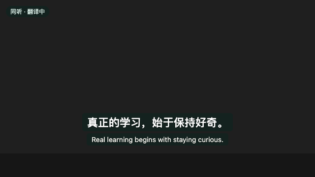
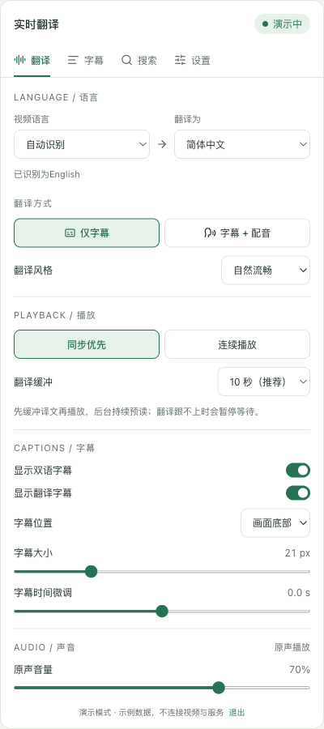
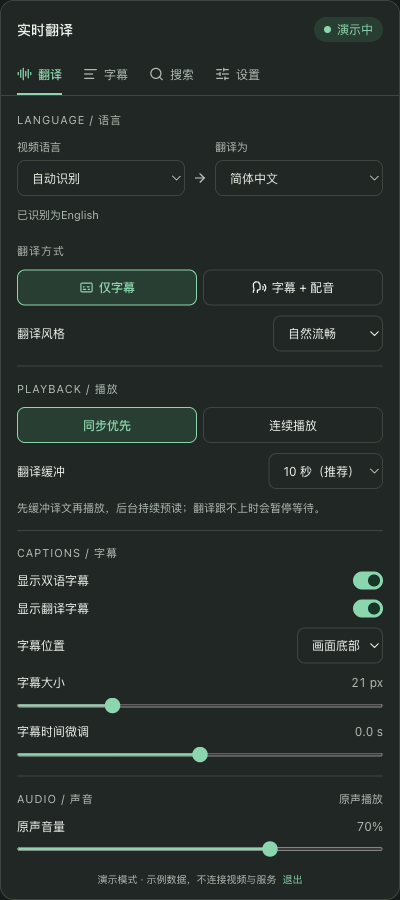
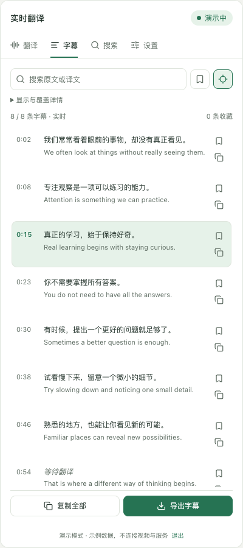
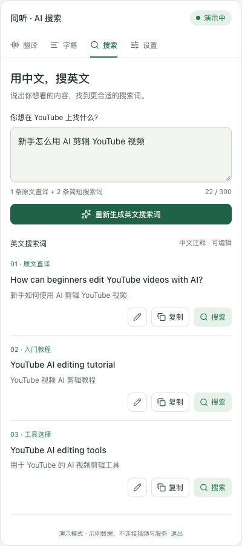
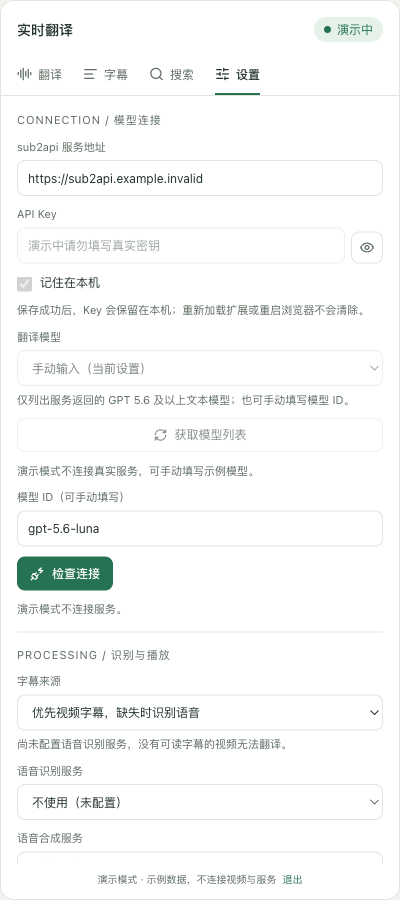
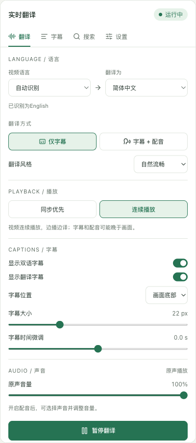
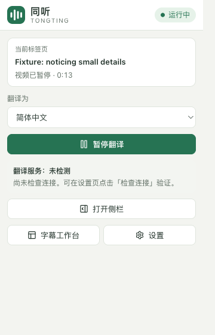
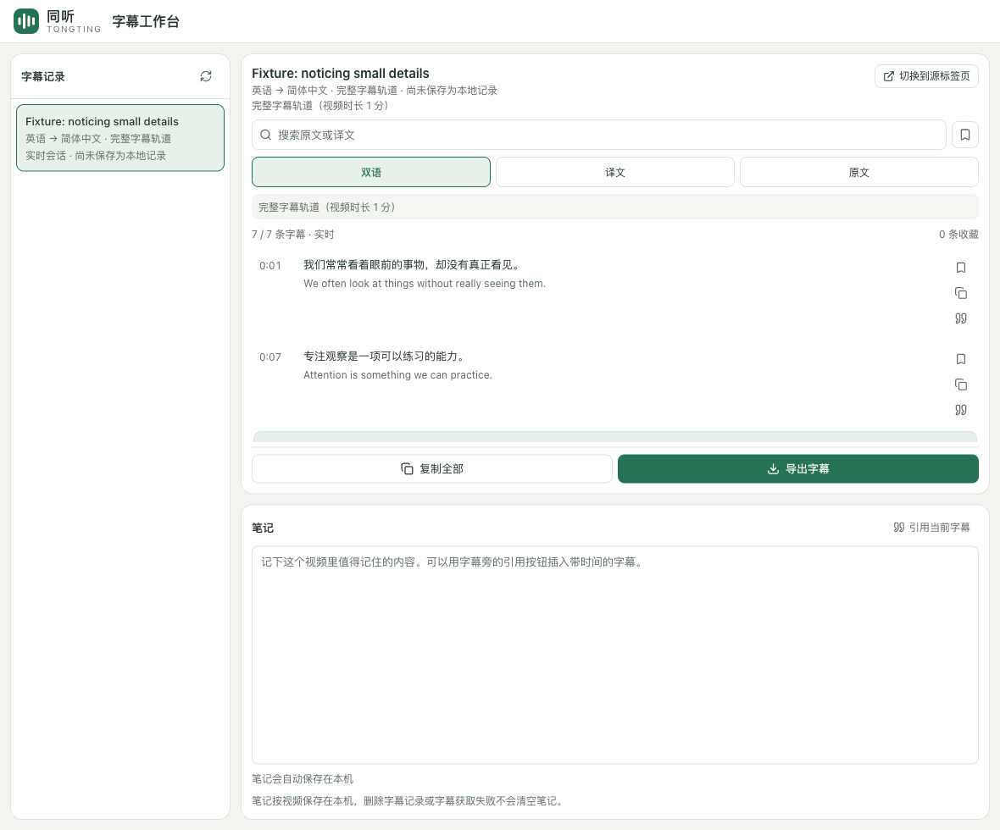
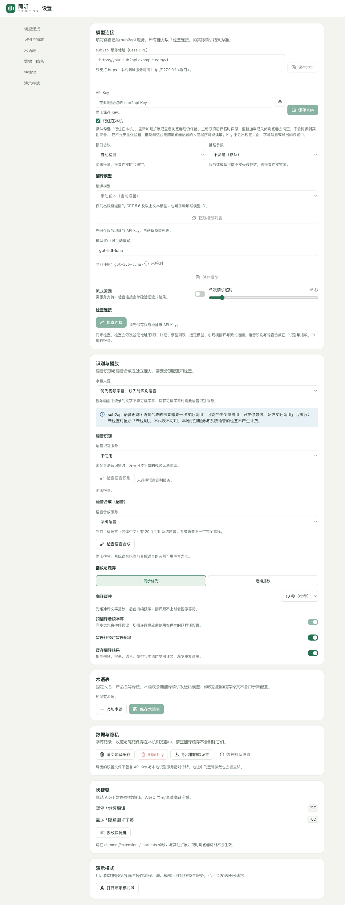

# 同听 · Tongting

[English](README.md) · **简体中文**

一个 Chrome MV3 扩展：在 YouTube 网页上边看边生成目标语言的翻译字幕，并可选择播放翻译配音。文本翻译走**你自己**部署的 [sub2api](https://github.com/Wei-Shaw/sub2api) 服务——扩展不内置任何 Key，也没有托管后端。没有可读字幕的视频需要另行配置语音识别服务，本仓库附带了一个本地服务。

默认目标语言取自浏览器界面语言：中文界面得到简体或繁体中文，其他界面在可选的目标语言里匹配自己的语言，匹配不到则用英文。这个默认值在首次安装时确定并保存，之后更改浏览器语言不会改变它；**恢复默认设置**时按同样规则重新确定。你随时可以自己改。



> 该图由仓库内置的本地播放器夹具配合模拟翻译服务生成。本 README 中每张截图的来源都写在[截图](#截图)一节。

---

## 项目状态

这是一个可以跑起来的扩展，但不是完成品。动手之前请先看这一节。

**已端到端验证**：对真实 sub2api 服务的文本翻译（模型列表、Responses / Chat 协议、结构化输出、流式返回），以及本地合成测试视频上「本地 Whisper 识别 → 翻译 → 系统中文配音」的完整链路。

**尚未验证**：

- 真实 YouTube 的长时间观看。隔离浏览器中两个公开视频播放约 40～50 秒后报播放错误，关闭扩展的对照组同样出错；原生字幕请求返回空正文。20 分钟连续观看尚未通过。
- 经 sub2api 的云端语音识别与云端语音合成。已通过的测试用的是本地 Whisper 和操作系统的中文声音。
- 需要人工完成的部分：点击工具栏授权标签页音频捕获、真人判断配音听感、20～30 分钟连续运行。

逐项能力的实测状态见 [docs/CAPABILITIES.md](docs/CAPABILITIES.md)；自动化结果与验收矩阵见 [docs/VALIDATION.md](docs/VALIDATION.md)。

**本项目不承诺「任何语言、任何视频、零延迟」。** 支持范围以验证记录为准。

---

## 功能

### 有字幕的视频

读取播放器提供的字幕轨道，经 sub2api 文本模型翻译后覆盖显示在原生播放器上。双语显示、字号、位置、背景透明度和时间微调都可调。

### 没有字幕的视频

两种播放方式：

- **同步优先（默认）**：先准备约 10 秒译文再继续播放（可选 5 / 10 / 20 秒）。对没有完整字幕轨道的公开录播，由本地服务预读后续音轨、识别并提前翻译。需要[本地识别服务](services/asr-local/README.md)。
- **连续播放**：捕获当前标签页音频，边播边识别。字幕和配音可能晚于画面。

「缓冲就绪」指的是**译文**已经准备好，不代表音频已经预先合成，也不是零延迟保证。

### 翻译配音

系统语音，或在你的服务上实测可用后的 sub2api 语音合成。默认全程静音原声——中文停顿时也不恢复——声音、语速、配音音量都可调，也可以手动选择保留原声。

### 字幕工作台

搜索、收藏、带时间的笔记、复制，导出 SRT / VTT / TXT，并如实说明这份记录实际覆盖了多少内容。

### 用你的语言找视频

在侧栏「搜索」里用自己的语言说出你想看什么，AI 按你选择的搜索语言（默认英文）生成 3 组搜索词，并附上你的语言写的注释，每组都可编辑、复制、在新标签页搜索。「我的语言」默认跟随翻译目标语言（它按浏览器界面语言确定）。生成质量因模型和语言组合而异。最近记录只留在本机。复用你已经配置好的翻译服务和模型。

### 演示模式

用示例数据预览界面，标识常驻不消失，不连接任何视频与服务。

---

## 截图

下面每张图都由 [`tests/e2e/screenshots.spec.ts`](tests/e2e/screenshots.spec.ts) 生成，你可以自己重跑：

```sh
pnpm build
TONGTING_E2E=1 pnpm exec wxt build
TONGTING_SHOTS=1 pnpm exec playwright test tests/e2e/screenshots.spec.ts
```

两类来源，每张图都已标注：

- **演示模式**——产品构建加 `?demo=1`。示例数据，界面持续显示「演示模式」标识，不连接服务。
- **本地夹具**——真实扩展（真实 service worker 协调器、真实内容脚本、真实覆盖层），但 YouTube 指向仓库内置的夹具页和 ffmpeg 合成的静音视频，sub2api 指向本地模拟服务。图中的中文来自模拟服务里的固定对照表，不是任何模型的输出。

界面目前只有简体中文。

|                                                                               |                                                                                          |
| ----------------------------------------------------------------------------- | ---------------------------------------------------------------------------------------- |
| **侧栏 · 翻译**（演示模式）<br>  | **侧栏 · 翻译 · 深色**（演示模式）<br> |
| **侧栏 · 字幕**（演示模式）<br> | **侧栏 · 搜索**（演示模式）<br>                |
| **侧栏 · 设置**（演示模式）<br>   | **侧栏 · 运行中的会话**（本地夹具）<br>       |

**工具栏弹窗**（本地夹具，会话运行中）



**字幕工作台**（本地夹具）——双语 / 译文 / 原文视图，逐条收藏与引用，按视频记笔记，导出



**完整设置页**（产品构建，尚未配置——新安装时就是这个样子）



---

## 安装

### 直接下载构建产物（不需要装工具链）

到 [**Releases**](https://github.com/senjanson/tongting/releases) 下载最新的 `tongting-<版本>-chrome.zip`，然后：

1. 解压。
2. 打开 `chrome://extensions`，开启右上角的**开发者模式**。
3. 点击**加载已解压的扩展程序**，选择解压出来的文件夹。

每个 Release 的 zip 都由 [GitHub Actions](.github/workflows/release.yml) 从对应 tag 的提交构建，并且在类型检查、ESLint、格式检查、单元与集成测试全部通过之后才发布。每个 Release 都附带 zip 的 SHA256。

> 这是解压包，不是商店签名的 `.crx`，所以必须用开发者模式加载。扩展尚未上架 Chrome 商店。

装好之后要在设置页填上**你自己的** sub2api 服务——见[指向你的 sub2api 服务](#指向你的-sub2api-服务)。不填的话什么都跑不了，扩展不内置任何 Key。

### 从源码构建

见下面的[快速开始](#快速开始)。

## 环境要求

| 项目                | 版本                         | 说明                                                                   |
| ------------------- | ---------------------------- | ---------------------------------------------------------------------- |
| Node                | 24.15.0                      | 见 `.nvmrc` 与 `package.json` 的 `volta` 字段；WXT 0.21 要求 Node ≥ 22 |
| pnpm                | 10.33.0                      | `packageManager` 字段                                                  |
| Chrome              | ≥ 116（桌面版）              | manifest `minimum_chrome_version`                                      |
| Playwright Chromium | 随 `@playwright/test` 1.63.0 | 仅扩展 E2E 使用；品牌版 Chrome 137+ 不再支持命令行加载扩展             |
| Python + uv         | 3.12–3.13                    | 可选，仅本地识别服务需要，见 [docs/ASR_LOCAL.md](docs/ASR_LOCAL.md)    |

本机默认 Node 版本较低时先切换：

```sh
export PATH=$HOME/.volta/tools/image/node/24.15.0/bin:$PATH
node -v   # 应输出 v24.15.0
```

详细环境记录见 [docs/ENVIRONMENT.md](docs/ENVIRONMENT.md)。

---

## 快速开始

```sh
pnpm install     # 会自动执行 wxt prepare
pnpm build       # 输出到 .output/chrome-mv3
```

然后打开 `chrome://extensions`，开启**开发者模式**，点击**加载已解压的扩展程序**，选择 `.output/chrome-mv3`。

### 指向你的 sub2api 服务

1. 打开扩展设置页（工具栏弹窗 → **设置**），第 2～6 步都在「模型连接」区块中完成。
2. 填写 **sub2api 服务地址（Base URL）**，点击**保存地址**。只支持 https，本机调试可用 `http://127.0.0.1:<端口>`。
3. 点击**授予访问权限**，在 Chrome 弹窗中允许。授权之前，扩展不会向该地址发送任何请求。
4. 粘贴 **API Key**。「记住在本机」默认勾选：Key 保存在本机，重新加载扩展或重启浏览器后仍在；取消勾选则只存在会话存储里。然后点击**保存 Key**。
5. 点击**获取模型列表**——保存地址与 Key 并授权之后它才可用。选择模型后点击**保存模型**；只在列表里选中不会保存。
6. 点击**检查连接**——它会依次验证主机权限、可达性、认证、模型列表、模型本身、小规模翻译与流式返回。

扩展只为当前保存的服务地址申请主机权限，只有一个 origin。更换地址（或**恢复默认设置**清空地址）并保存成功后，扩展会移除旧地址的访问权限；如果旧地址仍被其他设置（例如本地识别地址）使用，则保留。使用本地识别服务时，在「识别与播放」点击**授予本机服务访问权限**，还会申请 `http://127.0.0.1:<端口>`（你填写的端口）的访问权限。需要翻译的字幕文本只发往你的 sub2api 地址。

语音识别与语音合成是独立能力，在「识别与播放」中分别配置、分别检查（**检查语音识别** / **检查语音合成**）。检查本地识别服务或系统语音不产生费用。sub2api 的音频检查会实际调用一次，可能产生费用，只有你为这一次检查勾选确认后才会执行。

详细步骤见 [docs/USER_GUIDE.md](docs/USER_GUIDE.md)。

### 可选：本地语音识别服务

`services/asr-local` 是一个 Python + FastAPI + faster-whisper 服务，只监听 `127.0.0.1`。它负责没有字幕的视频，也是同步优先模式预读公开录播的基础。它有独立的环境，**不会**被 `pnpm install` 安装，见 [docs/ASR_LOCAL.md](docs/ASR_LOCAL.md) 与 [services/asr-local/README.md](services/asr-local/README.md)。

---

## 脚本

| 命令                                | 作用                                                                                                                                                                                                                                                 |
| ----------------------------------- | ---------------------------------------------------------------------------------------------------------------------------------------------------------------------------------------------------------------------------------------------------- |
| `pnpm dev`                          | WXT 开发构建，输出到 `.output/chrome-mv3-dev`。已关闭自动打开浏览器，需要手动加载该目录                                                                                                                                                              |
| `pnpm build`                        | 生产构建，输出到 `.output/chrome-mv3`                                                                                                                                                                                                                |
| `pnpm zip`                          | 打包为 zip（输出到 `.output/`），仅用于本地分发，不发布商店                                                                                                                                                                                          |
| `pnpm format` / `pnpm format:check` | Prettier 格式化 / 检查                                                                                                                                                                                                                               |
| `pnpm lint`                         | ESLint                                                                                                                                                                                                                                               |
| `pnpm typecheck`                    | `wxt prepare` 后执行 `tsc --noEmit`（严格模式）                                                                                                                                                                                                      |
| `pnpm test`                         | Vitest 单元测试（`tests/unit`）                                                                                                                                                                                                                      |
| `pnpm test:integration`             | Vitest 集成测试（`tests/integration`），使用模拟 sub2api、模拟播放器与音频资源                                                                                                                                                                       |
| `pnpm test:e2e`                     | Playwright 扩展 E2E（`tests/e2e`）。需先 `pnpm build` 与 `TONGTING_E2E=1 pnpm exec wxt build`；首次可能还需 `pnpm exec playwright install chromium`。会发声的用例默认跳过，用 `TONGTING_E2E_ASR=1`、`TONGTING_E2E_TTS=1`、`TONGTING_P0_AUDIO=1` 开启 |
| `pnpm smoke:sub2api`                | 对真实 sub2api 的冒烟测试。会产生真实调用与可能的费用，只在确实需要时运行                                                                                                                                                                            |

冒烟测试的凭证：复制 `.env.example` 为 `.env.local`（已被 gitignore），填写 `SUB2API_BASE_URL` 与 `SUB2API_API_KEY`。不要把 Key 写进命令行参数、源码、文档或任何可能被分享的文件。默认只测文本接口；设置 `SUB2API_TTS_MODEL` / `SUB2API_TTS_VOICE` / `SUB2API_ASR_MODEL` 会增加计费的音频调用。

---

## 目录结构

```text
entrypoints/                    WXT 入口（薄封装，实现放在 src/）
  background.ts                 service worker 入口（调用 src/background/wiring.ts 装配协调器）
  youtube.content/              YouTube 主内容脚本（ISOLATED world）：播放器、字幕、覆盖层
  youtube-bridge.content.ts     YouTube MAIN world 桥：只读必要的播放器元数据，数据一律视为不可信
  popup/                        工具栏弹窗
  sidepanel/                    侧栏（翻译 / 字幕 / 搜索 / 设置）
  options/                      完整设置页
  workspace/                    字幕工作台
  offscreen/                    offscreen 文档：标签页音频捕获、识别分段、合成音频播放
src/
  domain/                       领域类型与 schema：设置、会话、字幕 cue、能力状态、错误、语言
  messaging/                    跨上下文协议：UI、内容脚本、offscreen 消息 schema 与端口
  background/                   会话协调器、会话生命周期、设置/凭证存储、依赖装配
  youtube/                      PlayerAdapter、导航、字幕来源、MAIN 桥客户端、字幕覆盖层、原声 ducking
  captions/                     字幕解析（json3 / srv3 / vtt）、规范化、合句、增量与 ASR 字幕组装
  translation/                  翻译调度器、重试策略、播放缓冲、音频预读
  providers/text/               sub2api 文本适配器：Base URL、Responses / Chat、SSE、校验、连接检查
  providers/asr/                语音识别契约与客户端（本地服务、sub2api）
  providers/tts/                系统语音、sub2api 语音合成、配音控制器
  audio/                        PCM、重采样、分段、识别队列、媒体时间轴、资源清理、offscreen 客户端
  storage/                      IndexedDB：字幕记录、收藏、笔记、翻译缓存、搜索历史
  export/                       SRT / VTT / TXT 生成、覆盖范围说明、下载
  ui/                           共享组件、主题、状态客户端、各页面、字幕视图、演示数据
tests/
  unit/                         单元测试
  integration/                  集成测试（模拟 sub2api 服务、协调器 harness）
  e2e/                          Playwright 扩展 E2E（YouTube 路由到本地夹具页面）
  smoke/                        真实 sub2api 冒烟测试（显式运行）
  fixtures/                     人工构造的字幕与 sub2api 响应夹具
services/asr-local/             本地语音识别服务（Python + FastAPI + faster-whisper，仅监听 127.0.0.1）
public/icon/                    扩展图标
docs/                           文档（索引见下）
```

---

## 隐私与安全

- **Key 是你的。** API Key 与本地识别配对令牌不进入快照广播、内容脚本、DOM、URL、日志、错误信息、导出设置、测试夹具或文档。
- **只授权你配置的地址。** 主机权限只申请当前保存的那个 sub2api 地址；使用本地识别服务时，另外申请 `http://127.0.0.1:<端口>`。地址变化并保存成功后，扩展会移除不再被任何配置使用的旧地址的访问权限。
- **翻译请求只带字幕文本**——cue id、文本、目标语言与提示词。不含页面地址、视频标题或带签名的播放器参数。
- **系统声音可能联网。** 用系统声音配音时，译文交给 Chrome 的语音引擎（`chrome.tts`）朗读。声音列表里标为「联网声音」的由远端合成，要朗读的译文会发给该声音的提供方（Chrome 的 Google 在线声音即发给 Google）；标为「本机声音」的在本机合成。「自动选择」在匹配程度相同时优先本机声音；不希望译文离开本机时，请自己选一个「本机声音」。
- **本地数据留在本地。** 字幕记录、收藏、笔记和翻译缓存都在浏览器的 IndexedDB 里。本地识别服务只绑定 `127.0.0.1`，也不把媒体写到磁盘。
- **默认不可信。** MAIN world 与页面数据、存储读出的内容、模型与服务返回，使用前全部经 zod 校验。
- **不伪造成功。** 能力状态只来自真实调用；失败不会悄悄退回演示数据；没有数据时界面显示「未知 / 未检测」，不猜。

---

## 开发约定

- **契约优先。** 跨模块、跨进程的类型与 schema 集中在 `src/domain/`、`src/messaging/` 与各 `src/providers/*/types.ts`。本地识别服务的 HTTP 契约写在 `src/providers/asr/types.ts`，`services/asr-local` 必须与之一致。改契约时两边和测试一起改。
- **service worker 是业务状态的权威来源。** UI 只发命令、只接受更新版本的快照，不各自持有翻译客户端或 Key。
- **显式导入。** WXT 配置为 `imports: false`，路径别名 `@src` 指向 `src/`；TypeScript 严格模式。
- **测试分层。** 纯逻辑写单元测试；需要副作用计数（请求、tracks、队列、释放）的用集成测试；扩展加载与页面往返用 E2E。工具栏手势、真实音频、系统声音、真实 YouTube 与 sub2api 只能人工或冒烟测试覆盖，并在 [docs/VALIDATION.md](docs/VALIDATION.md) 如实记录。不以删除断言、跳过测试或吞掉异常换取通过。
- **Git 暂存区由用户控制。** 协作者（包括自动化工具）不执行 `git add` / `git stage` / `git commit -a` 或任何改变索引的操作，不自动提交；所有修改留在工作区，由用户自行 review 与暂存。

---

## 明确不做

不做：手机、Safari、Firefox 版本；音色克隆、唇形同步、视频重编码、视频下载器；任意网站的通用音频捕获；多人会议；账号系统、支付、团队后台；改写或绕过 DRM、付费墙、登录限制及其他内容访问控制；画面内烧录文字的 OCR；发布到扩展商店或部署公共服务器。

直播、Shorts、画中画不在首批验收范围内，未验证前不宣称支持。

---

## 文档

| 文档                                         | 内容                                                |
| -------------------------------------------- | --------------------------------------------------- |
| [docs/USER_GUIDE.md](docs/USER_GUIDE.md)     | 安装、配置 sub2api、使用、隐私、故障排查与已知限制  |
| [docs/ASR_LOCAL.md](docs/ASR_LOCAL.md)       | 本地识别服务的安装、启动/停止、模型下载、性能与排障 |
| [docs/VALIDATION.md](docs/VALIDATION.md)     | 自动化测试结果、T01–T40 验收矩阵与真实链路实测记录  |
| [docs/CAPABILITIES.md](docs/CAPABILITIES.md) | 服务、浏览器、YouTube 能力矩阵与权限说明            |
| [docs/PROGRESS.md](docs/PROGRESS.md)         | 阶段进度、阻塞项与技术决策                          |
| [docs/ENVIRONMENT.md](docs/ENVIRONMENT.md)   | 开发与验证环境、网络限制                            |

---

## 许可证

[MIT](LICENSE)
